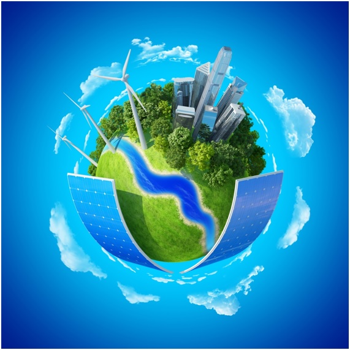

Proteger, restaurar y promover el uso sotenible de los ecosistemas terrestres, el manejo de los bosques, combatir la desertificacion y detener y revertir la degradacion de la tierra y detener la perdida de biodiversidad.

