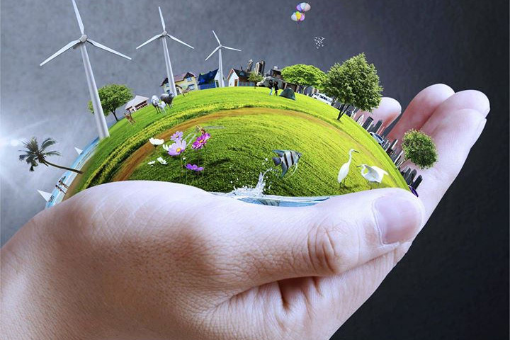

Una de las opciones mas recomendadas es Reciclar, reutilizar y reducir.
Es importante que en nuestro día a día seamos consumidores responsables y compremos productos amigables con el medio ambiente. De esta manera, y a través de la acción y conciencia colectiva, podremos generar un mayor impacto en pro de nuestro planeta.

